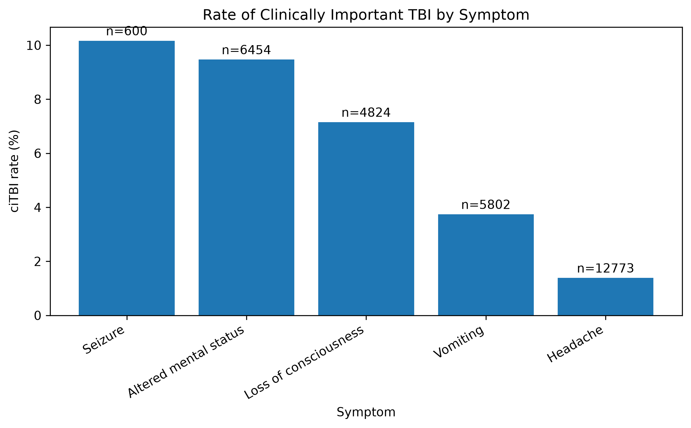
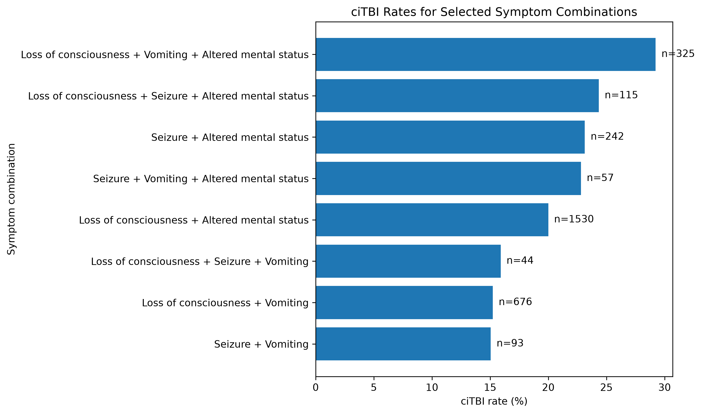
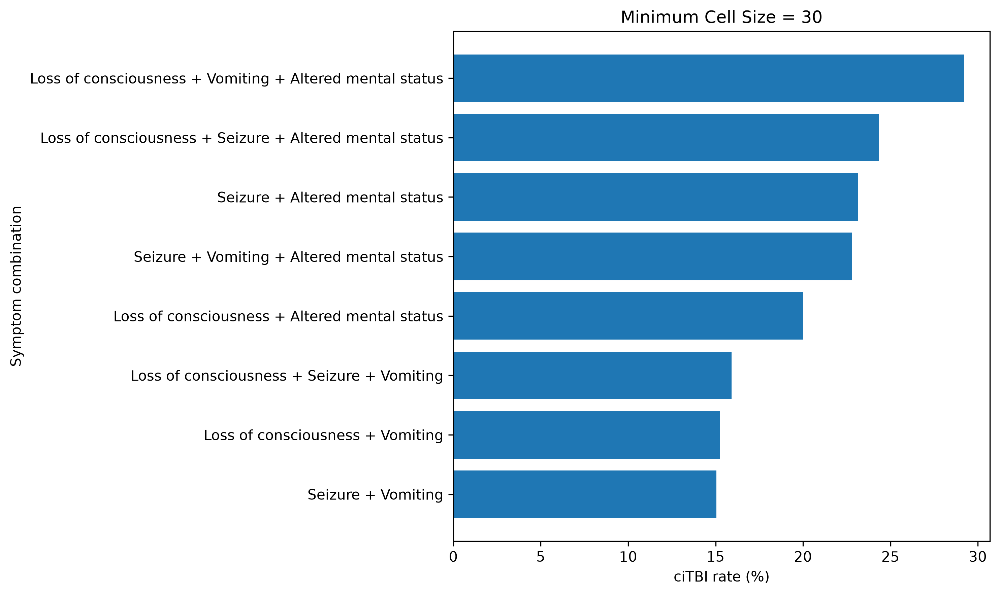
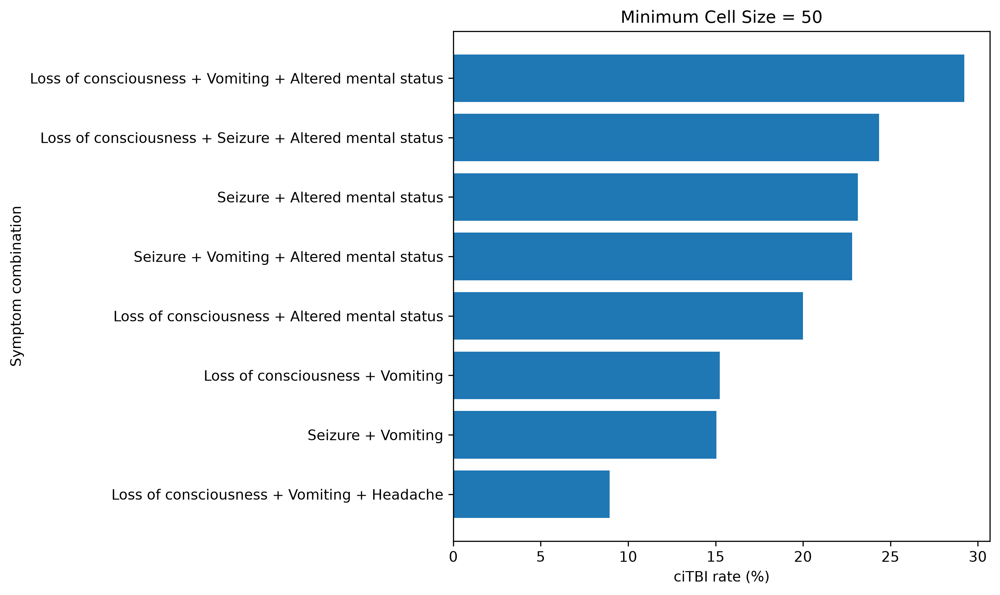
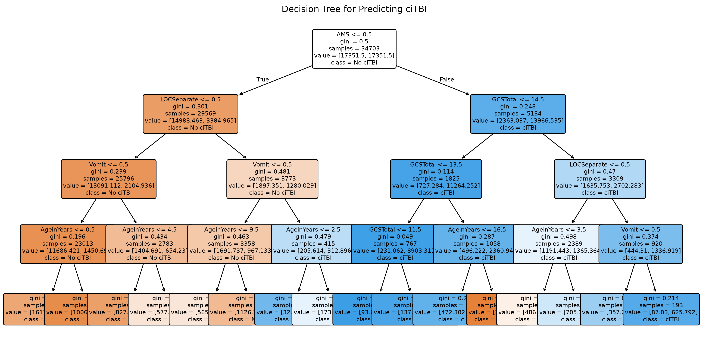

# Lab 1 - PECARN TBI Data

## 1. Introduction

- Pediatric traumatic brain injury (TBI) is an important clinical problem because serious injuries need to be identified quickly.
- CT scans can detect traumatic brain injuries, but unnecessary CT scans expose children to ionizing radiation.
- The purpose of this analysis is to examine the PECARN pediatric head trauma data, clean the dataset using the provided documentation, explore patterns related to clinically important TBI (ciTBI), and compare two simple classification models.
- The analysis focuses especially on clinical symptoms that may help identify patients with higher ciTBI risk.

## 2. Data

The dataset contains 43,399 patient records and 125 variables.

The variables include demographic characteristics, injury mechanisms, symptoms, neurological assessments, CT information, and clinical outcomes.

The main outcome used in this analysis is `PosIntFinal`, which indicates clinically important TBI (ciTBI).

### 2.1 Data Collection

- The data come from the PECARN study of children younger than 18 who were evaluated after head trauma.
- Patients were treated at multiple emergency departments.
- Clinical characteristics were recorded using standardized forms.
- CT scans were not given randomly; whether a patient received a CT scan depended on clinical judgment.
- Some symptoms were not collected for all age groups. For example, headache, amnesia, and dizziness were not recorded for children younger than two in the original study.
- Because of these differences in data collection, some missing values are structural rather than data errors.

## 2.2 Data Cleaning

Initial checks showed:

- 43,399 observations
- 125 variables
- No completely duplicated rows
- No duplicated patient IDs

The documentation was especially important because many variables use numeric codes that have special meanings.

For example:

- `92` often represents "Not applicable"
- `90` sometimes represents a meaningful category such as "Other"
- `91` can also represent a meaningful category, such as pre-verbal or non-verbal status

Therefore, numeric values were not automatically treated as missing.

For variables where the documentation explicitly defined `92` as "Not applicable," those values were converted to missing values.

Other meaningful special values such as 90 or 91 were preserved.

Several logical consistency checks were also performed.

Examples:

- Patients without loss of consciousness generally had `LocLen = 92`, meaning that duration was not applicable.
- Patients without seizures generally had `SeizOccur = 92`.
- Patients who did not receive a CT scan had `PosCT = 92`.
- Patients who did not receive a CT scan also had CT finding variables coded as not applicable.

These checks suggested that much of the apparent missingness was structural and consistent with how the data were collected.

## 2.3 Data Exploration

The main outcome, ciTBI, was rare.

`PosIntFinal` contained approximately:

- 42,616 patients without ciTBI
- 763 patients with ciTBI
- 20 missing outcome values

The exploratory analysis focused on several clinically important symptoms:

- Loss of consciousness
- Seizure
- Vomiting
- Headache
- Altered mental status

Headache required additional care because it was not collected in the same way for very young children. For the headache analysis, children younger than two were excluded and only clear yes/no headache values were compared.

## 3. Findings

## 3.1 First Finding: ciTBI Rates by Individual Symptom

The first analysis compared the observed ciTBI rate among patients with each symptom.

Observed rates were approximately:

- Seizure: 10.2% (`n = 600`)
- Altered mental status: 9.5% (`n = 6,454`)
- Loss of consciousness: 7.2% (`n = 4,824`)
- Vomiting: 3.7% (`n = 5,802`)
- Headache: 1.4% (`n = 12,773`)

Main interpretation:

- Seizure and altered mental status had the highest observed ciTBI rates among the individual symptoms examined.
- Loss of consciousness was also associated with a relatively high rate.
- Vomiting and headache had lower observed rates.
- These are descriptive associations and should not be interpreted as causal effects.

## 3.2 Second Finding: Symptom Combinations

The second analysis examined combinations of two and three symptoms.

To avoid emphasizing extremely small groups, symptom combinations with fewer than 30 observations were excluded.

Some of the highest observed ciTBI rates were:

- Loss of consciousness + Vomiting + Altered mental status:
  approximately 29.2%, `n = 325`

- Loss of consciousness + Seizure + Altered mental status:
  approximately 24.3%, `n = 115`

- Seizure + Altered mental status:
  approximately 23.1%, `n = 242`

- Seizure + Vomiting + Altered mental status:
  approximately 22.8%, `n = 57`

- Loss of consciousness + Altered mental status:
  approximately 20.0%, `n = 1,530`

Main interpretation:

- Patients with multiple high-risk symptoms had substantially higher observed ciTBI rates than patients with individual symptoms alone.
- The combination of loss of consciousness, vomiting, and altered mental status had the highest observed rate among the combinations examined.
- These groups overlap; a two-symptom group may also include patients with additional symptoms.

## 3.3 Reality Check

The observed patterns are broadly consistent with the clinical relationships described in the original PECARN study.

Altered mental status, loss of consciousness, vomiting, and other clinical characteristics were important components of the PECARN prediction rules.

The similarity between the published clinical predictors and the patterns observed in the cleaned dataset provides some reassurance that the cleaning process preserved clinically meaningful relationships.

However:

- This comparison is only a reality check.
- It does not show that these symptoms cause ciTBI.
- The analysis remains observational.

## 3.4 Stability Check

A judgment call in the symptom-combination analysis was the minimum number of observations required for a combination to be included.

The original analysis used:

- Minimum cell size = 30

The analysis was repeated using:

- Minimum cell size = 50

Main result:

- The highest-risk symptom combinations remained largely unchanged.
- Loss of consciousness + vomiting + altered mental status remained the combination with the highest observed ciTBI rate.
- Several small groups disappeared after increasing the threshold.
- For example, loss of consciousness + seizure + vomiting had only 44 observations and was excluded under the minimum size of 50.

Interpretation:

- The main finding was reasonably stable to this change in the minimum cell-size threshold.
- The perturbation mainly affected smaller combinations rather than the overall pattern.

## 4. Modeling

## 4.1 Implementation

The goal of the modeling analysis was to predict clinically important TBI rather than simply predict whether clinicians actually ordered a CT scan.

Outcome:

- `PosIntFinal`

Predictors:

- Age
- GCS total
- Loss of consciousness
- Seizure
- Vomiting
- Altered mental status

CT results such as `PosCT` were not included because those variables are only known after the CT scan and would create information leakage.

Two classification methods were used:

1. Logistic regression
2. Decision tree

Modeling choices:

- 80% training data / 20% test data
- Stratified train-test split because ciTBI is rare
- Median imputation for missing predictor values
- `class_weight = balanced`
- Decision tree maximum depth = 4
- Sensitivity was emphasized because missing a clinically important TBI is particularly costly

## 4.2 Stability

The exploratory stability check changed the minimum sample-size threshold for symptom combinations from 30 to 50.

However, a full comparison of both models under the same data perturbation was not completed in the current analysis.

This should be treated as a limitation of the modeling stability analysis rather than claiming stability results that were not calculated.

## 4.3 Model Discussion

### Logistic Regression

Test-set results:

- True positives: 120
- False negatives: 33
- False positives: 1,232
- Sensitivity: approximately 78.4%
- Accuracy: approximately 85%

The logistic regression identified a larger proportion of actual ciTBI cases.

Positive coefficient directions were observed for:

- Altered mental status
- Vomiting
- Loss of consciousness
- Seizure

GCS total had a negative coefficient, meaning that higher GCS scores were associated with lower predicted ciTBI risk.

Coefficient sizes should not be directly interpreted as variable-importance rankings because predictors are measured on different scales.

### Decision Tree

Test-set results:

- True positives: 109
- False negatives: 44
- False positives: 1,029
- Sensitivity: approximately 71.2%
- Accuracy: approximately 88%

The decision tree produced fewer false positives than the logistic regression but missed more ciTBI cases.

Altered mental status had the largest feature importance in the decision tree.

Other variables used by the tree included:

- GCS total
- Loss of consciousness
- Vomiting
- Age

Seizure had zero feature importance in this specific tree. This does not mean that seizure is clinically unimportant; it only means that it was not selected as a split in this particular depth-limited tree.

### Comparison

The logistic regression had higher sensitivity than the decision tree.

The decision tree had fewer false positives.

This illustrates an important clinical tradeoff:

- Increasing sensitivity can reduce the number of missed serious injuries.
- However, it may also classify more patients as high risk and potentially increase unnecessary CT use.

The logistic regression is easy to interpret in terms of the direction of associations.

The decision tree is also interpretable because its prediction process can be represented as a sequence of clinical decision rules.

Both models identified altered mental status as an important predictor.

## 5. Conclusion

The dataset was computationally manageable, but data cleaning required careful interpretation of the documentation.

The largest challenge was not the number of observations but understanding the meaning of special values and structural missingness.

This analysis illustrates the three realms of the Data Science Life Cycle:

### Data / Reality

The PECARN dataset represents clinical observations collected from real pediatric head-trauma patients.

However, the dataset is not a perfect representation of clinical reality.

Some symptoms are difficult to measure consistently, some variables are not applicable to all patients, and some measurements depend on age or clinical circumstances.

### Algorithms / Models

The exploratory analyses, logistic regression, and decision tree are simplified representations of relationships in the observed data.

They help summarize and predict patterns but do not fully reproduce the clinical decision-making process.

### Future Data / Reality

A prediction model could potentially be applied to future patients to help identify children at higher risk of ciTBI.

However, future use would require careful consideration of both:

- missed clinically important injuries
- unnecessary CT scans

Overall findings:

- Altered mental status, seizure, and loss of consciousness were associated with relatively high observed ciTBI rates.
- Certain combinations of symptoms were associated with substantially higher rates.
- The main symptom-combination finding was stable to changing the minimum cell-size threshold.
- Logistic regression had higher sensitivity than the decision tree, while the decision tree produced fewer false positives.

The results should be interpreted as descriptive and predictive rather than causal.

## 6. Collaborators

Write one of the following as appropriate:

None.

or

List any classmates or other people with whom you discussed the assignment.

## 7. Bibliography

Kuppermann, N., et al. (2009). Identification of children at very low risk of clinically-important brain injuries after head trauma: a prospective cohort study. *The Lancet*.